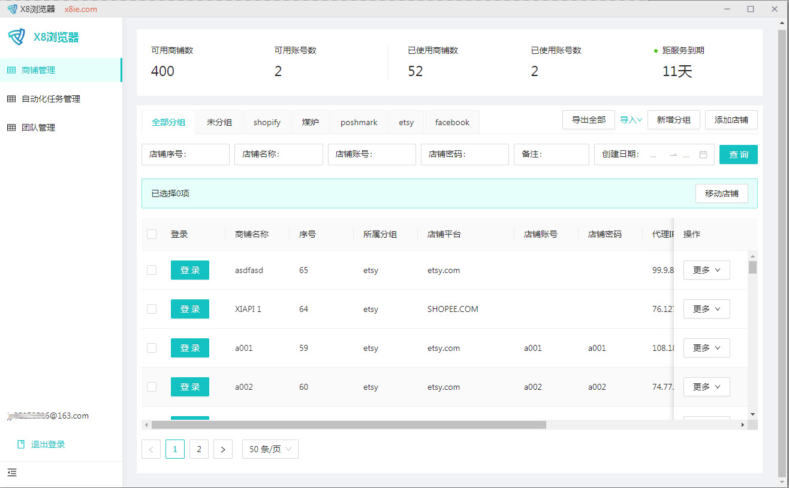

# X8浏览器帮助中心

x8防关联浏览器是一款为外贸而生的，多账号防关联指纹浏览器，它由**深圳，泉州，莆田**的资深程序员和经验丰富的外贸圈从业者联合开发并不断改进，目前已<mark style="color:red;">**收集最新的User Agent，为其他同类指纹浏览器的20倍**</mark> ，为每个账号提供独立的浏览器运行环境，保障账号之间互不关联。通过修改浏览器指纹阻止任何网站读取您真实的指纹信息，从而达到防追踪的目的。完美替代VPS、虚拟机等传统的账号防关联方式，解决一台电脑同时登陆运营多个账号的使用场景。浏览器适用于跨境电商多店铺运营、FB广告，google广告，海淘代购、广告联盟、SEO优化、社交媒体营销等多种行业应用。

官网 [https://www.x8ie.com](https://www.x8ie.com)目前在推广阶段，有<mark style="color:red;">20%的推荐奖励</mark>

**疑问：1.市场上有了这么多环境隔离系统，为什么我们要还要开发X8环境隔离系统？**

**答：市场上的软件很乱，质量参差不齐，安全漏洞频发，不乏优秀的软件，但是成本极高.**<mark style="color:red;">** 为了提高外贸数据安全性和大大降低广大外贸从业者运营成本**</mark>**，我们开发并优化了X8浏览器。**<mark style="color:red;">**它是一款目前市场上安全系数较高的防数据泄露隔离系统，从技术层面上保证你的数据不会被其他的公司看到，比如你目前在做的平台，还有广告产品数据，GOOGLE广告数据等商业机密**</mark>**）经过 7个版本的更迭，目前已大大降低环境隔离软件的运行成本，目前价格为其他同类产品的6分之一，并且基于多年外贸经验对面板体验度的深度开发优化，去掉冗沉的代码，提高软件性能。 收集的最新的User Agent全部为真实的** ，**并不断增加UA数量和改进功能中**&#x20;

**2.针对服务商的和大公司数据独立隐私的需求，预提供的服务有浏览器分销后台，服务器私有化，OEM 以确您数据的保独立性和安全级别**&#x20;

**我们正在预开发的有**

**1.**<mark style="color:red;">**最新版本浏览器内核更新**</mark>

**2.**<mark style="color:red;">**超级邮箱系统**</mark>**（集成在软件面板）告别购买邮箱失效的烦恼**

**3.在线文档（集成在软件面板）再也不用复制来复制去，随时随地可以办公**

**4.**<mark style="color:red;">**自动化脚本定制**</mark>**.......**&#x20;

**开发人员：MPC**

**协助开发: BEST **

**协助开发:我是来偷菜的，以及外贸圈资深从业者**

&#x20;**注册地：泉州乐见科技有限公司**

**备案：闽ICP备2021014102号**

**官网 ：**[**https://www.x8ie.com**](https://www.x8ie.com)

如果帮助文档没有解决您的问题，可以按照以下联系方式联系我们： qq <mark style="color:red;">**279234746**</mark>

**说明文档：福建 莆田  2021年 10月 19号**
