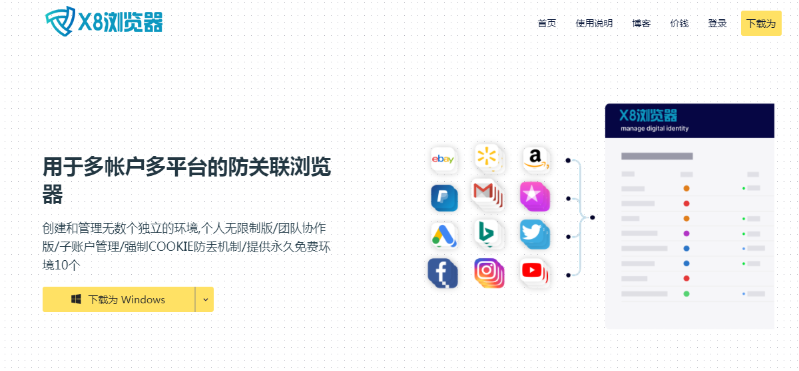

# 1、客户端下载安装

1、打开X8浏览器官网首页，点击“下载”；

2、或者进入“https://www.x8ie.com/download”下载页面，点击下载按钮下载；

3、通过浏览器下载，下方会显示下载进度；

4、找到下载后的安装文件，双击安装；

5、双击后点击按钮按钮；

6、等待安装进度，大概需要30秒钟的时间；

7、点击安装完成。

注意：首次安装可能会遇到360等软件误报提示，可以将软件加入到360的白名单里面，或者关闭360等安全软件。
