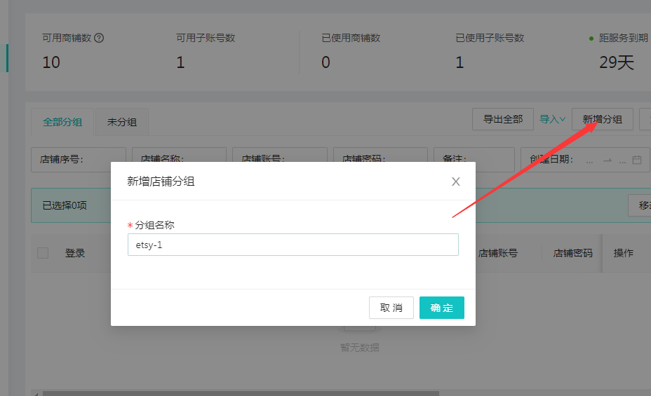
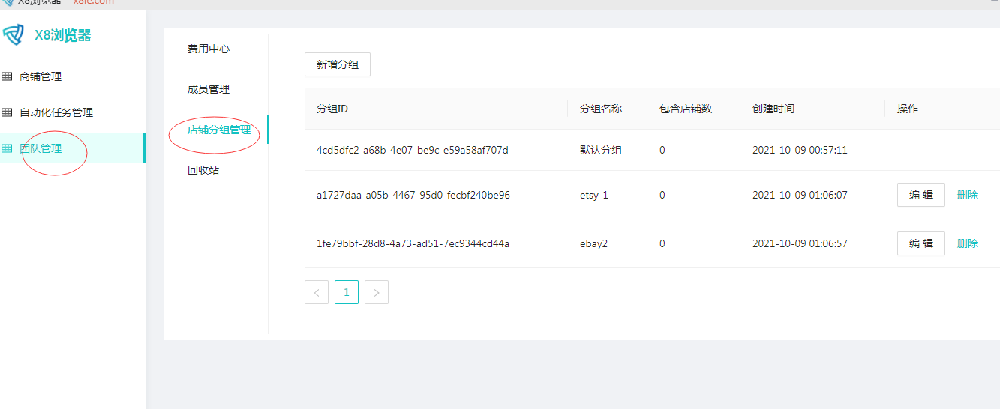
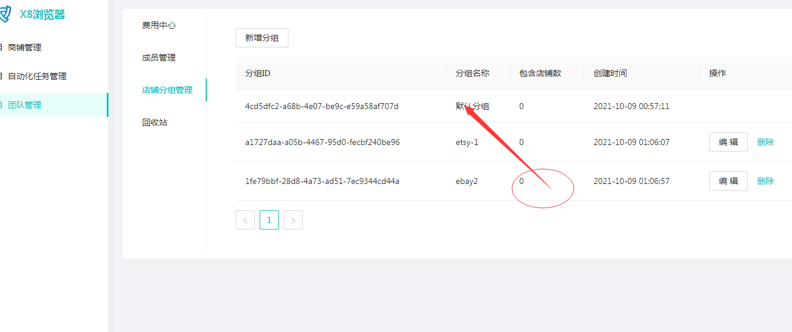
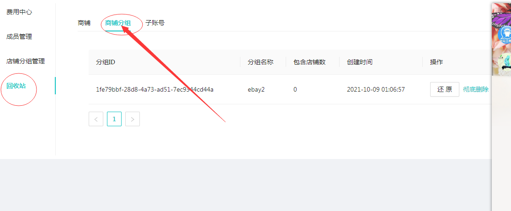

# 3、新建分组和管理分组

#### 1.在新建环境前，新建分组，点击<mark style="color:red;">新增分组</mark>按钮，输入你需要的分组名，点<mark style="color:red;">确定</mark>

#### 2.分组管理，点击”<mark style="color:red;">团队管理</mark>“

#### 3.删除分组，点击<mark style="color:red;">删除</mark>，可以删除分组到回收站，为了防止误删除，如果被删除的分组里有环境，会默认移动到默认分组，即未分组

#### 4.从回收站恢复分组，点<mark style="color:red;">回收站</mark>，选择商铺分组，选择<mark style="color:red;">彻底删除</mark>或者<mark style="color:red;">还原分组</mark>，原来的环境在默认分组，不会丢失

