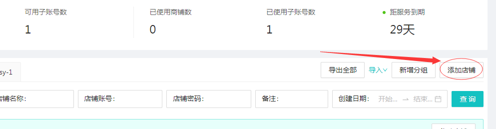
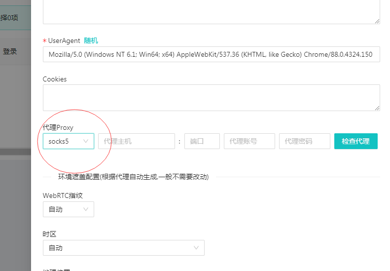

# 4、新建环境步骤

#### 1.新建环境，在商铺管理面板点击”<mark style="color:red;">添加店铺</mark>“

#### 2.根据需要填入<mark style="color:red;">所属分组</mark>，环境名称随意，可以填入你所做平台和编号，以便日后查找,如果“<mark style="color:red;">**店铺配置**</mark>”里没有所需平台，点"<mark style="color:red;">**其他**</mark>"填入自己的平台

.png>)

3.“<mark style="color:red;">**user Agent**</mark> ”是一个重要选项，指的是浏览器标识，系统默认随机生成一个Windows 系统的UA,可以点随机更换需要的系统和UA，我们集成了海量的UA,数量大约是<mark style="color:red;">**传统指纹浏览器的20倍**</mark>，约为<mark style="color:red;">3万</mark>个常用UA,所以基本上不用担心会用到重复的UA

#### 4<mark style="color:red;">**代理proxy**</mark>选择，我们集成了大部分代理，根据需要选择,http,https,socks5(<mark style="color:red;">第三方代理处购买</mark>）官网会有推荐，911自动，和911手动模式（911.re 处购买，<mark style="color:red;">需科学上网</mark>）

#### 5.<mark style="color:red;">环境遮盖配置</mark>，每个环境自动根据IP生成相对指纹，高度集成绝不重复，点击“<mark style="color:red;">检查代理”</mark>会自动生成指纹，不点击检查代理按钮，开启环境后也会自动生成，建议不点击检查代理按钮

.png>)

6.配置完成，点击<mark style="color:red;">登录</mark>即可打开新环境
