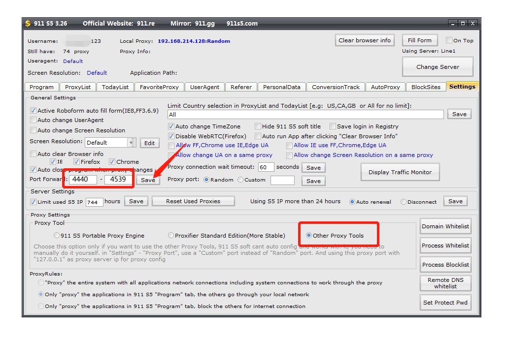
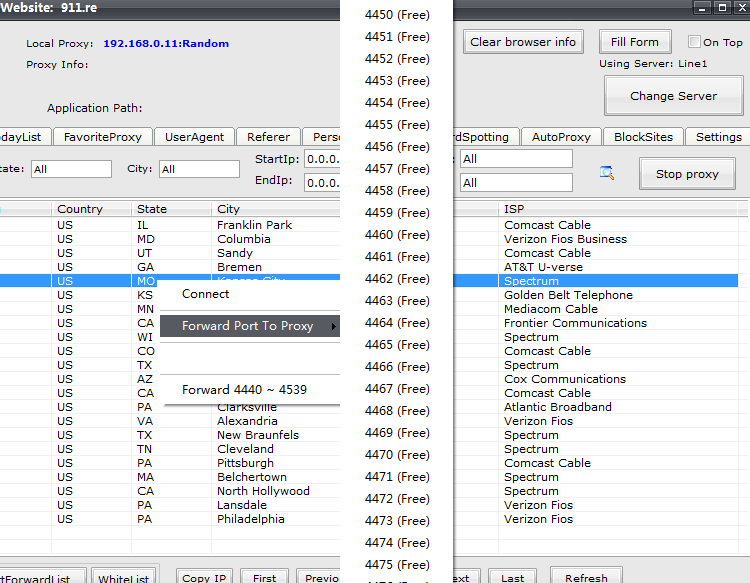
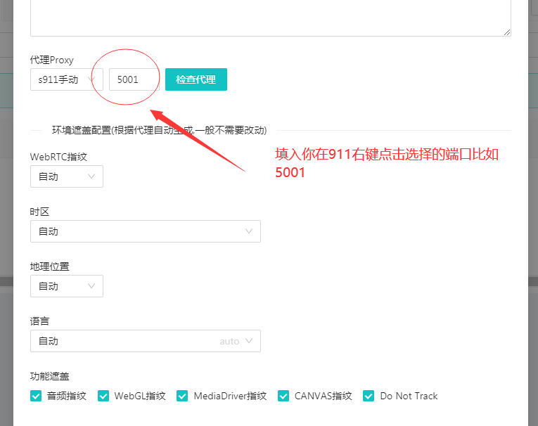
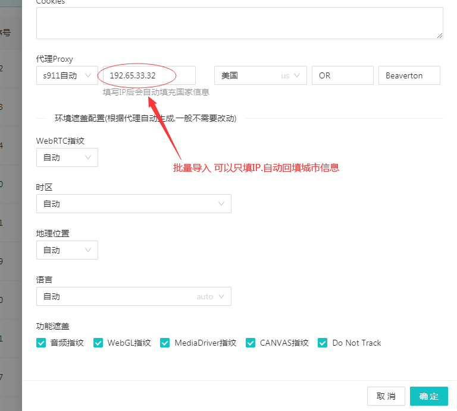
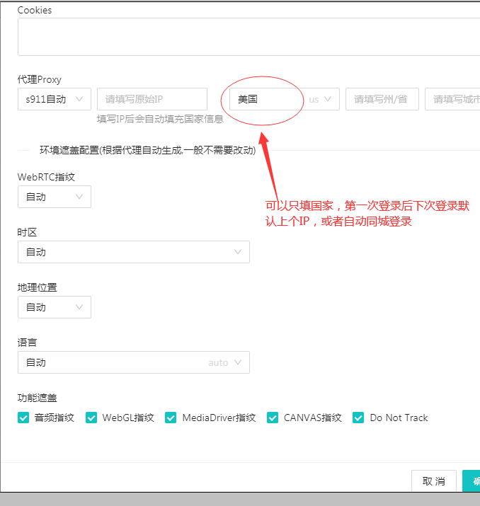
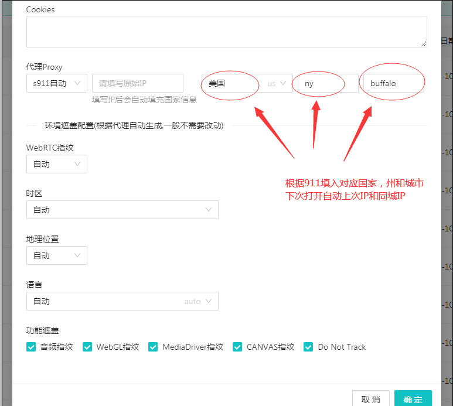

# 6、911S5代理IP配置（自动模式和手动模式）

1、（<mark style="color:red;">**手动模式**</mark>）首先去911.gg或者911.re（需<mark style="color:red;">**科学上网才能访问**</mark>）注册并购买IP，然后下载911客户端并安装，安装完后打开下图中所指示的图标；

2、在登陆窗口输入账号、密码，点击“Login”登录；

3、点击右上角X关闭窗口；

4、第一次打开911客户端先点击“Settings”进入设置页面；

5、在设置页面设置端口转发，填入一个端口范围<mark style="color:red;">4440-4539</mark>，点击“save”键保存，在“Proxy Tool”，选项中选择“Other Proxy Tools”;

6、然后点击“ProxyList”回到IP列表页面，；

7、在IP列表页选择IP所在国家，点击搜索按钮，出现该国家的IP列表；

8、在任意IP列表处单击鼠标右键在菜单中选择任意一个IP端口，并记住，千万不要选择“Froward 4440-4539”；

9、在点击“TodayList”就可以看到当天使用的IP列表了；

### 10、x8浏览器代理 <mark style="color:red;">911手动模式</mark>(配置好后保存直接打开环境即可）

### 11、<mark style="color:red;">**911自动模式，**</mark>**首先按以上911代理 IP配置**<mark style="color:red;">**1-6步骤**</mark>**，然后打开X8浏览器，保持**<mark style="color:red;">**911和X8客户端同时打开**</mark>** ，打开浏览器后如果连不上请在检测页点击**<mark style="color:red;">**刷新**</mark>**，或者**<mark style="color:red;">**重新代理**</mark>**，如果还连不上则重启客户端**

**新建环境选择代理的时候选择 **<mark style="color:red;">**911自动模式 **</mark>**自动模式下有以下3个填入方法**

**（1）**可以<mark style="color:red;">**只填IP**</mark>,系统会根据911的数据自动回填这个IP的<mark style="color:red;">**国家，州和城市**</mark>地址信息，并搜寻该IP,如果这个IP连不上则<mark style="color:red;">**自动同城IP**</mark>

**(2)可以**<mark style="color:red;">**只填国家**</mark>**，第一次连接后，根据上一次的**<mark style="color:red;">**IP自动回填详细国家城市**</mark>**，以后打开都是上次的IP,或者**<mark style="color:red;">**同城IP **</mark>** **

**（3）如果知道店铺详细所在地,**<mark style="color:red;">**填国家，省份，城市**</mark>**，请按911里的省份和城市简称详细填入，则每次打开都是**<mark style="color:red;">**上次的IP或者同城IP**</mark>

**（4）点击**<mark style="color:red;">**登录**</mark>**按钮打开浏览器即可**

**注意！！：该模式集成了**<mark style="color:red;">**端口复用功能，大大减少911 IP的浪费**</mark>**，即关闭环境再打开环境，依旧是同一个端口和**<mark style="color:red;">**同一个IP**</mark>**,除非掉线或者关闭整个客户端，系统会随机调用100个端口中的一个端口，不会串IP和端口**

<mark style="color:red;">**如果遇到WIN10以上系统提示911配置错误**</mark>**，这是系统权限问题，请右点桌面X8浏览器图标，选择管理员模式运行即可**
