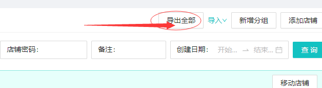
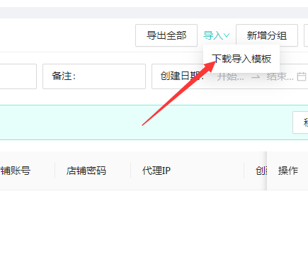
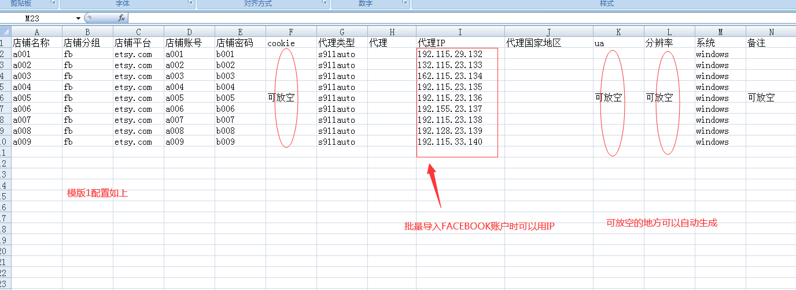
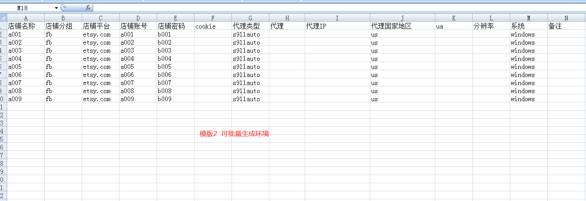
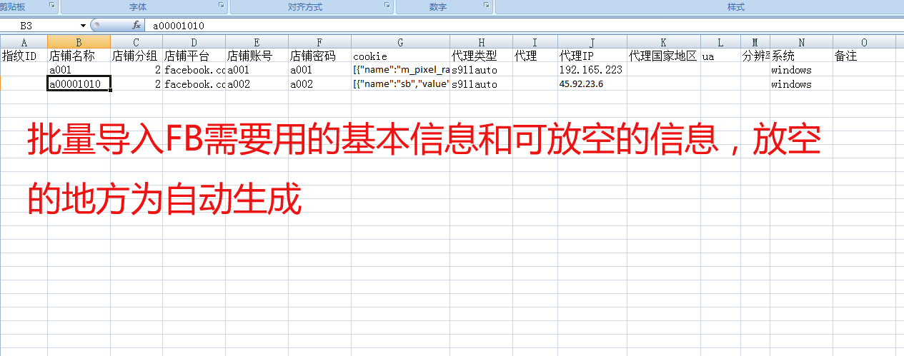

# 7、批量导出和导入功能（含facebook导入介绍）

Cookie导入可让您的网站账号保持登录状态。

## [#](7cookie-de-dao-ru-dao-chu-qing-kong.md#一、-导入cookie) 一、 批量导出（含账户信息和COOKIE） 

## [#](7cookie-de-dao-ru-dao-chu-qing-kong.md#二、导出cookie) 二、批量导入，点击导入，下拉模板，使用模板导入 

**3.批量导入模版的设置有两个模版，如下**

可批量生成环境2

4.facebook 导入模版介绍：

依次填入基本信息<mark style="color:red;">店铺名，店面分组，店铺平台，账号，密码，cookie，代理类型，代理IP,系统</mark>

其他可放空或根据需要填入

